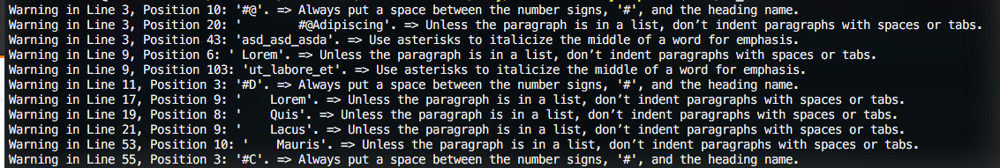

# Md Cleaner

> This is a linter program that checks for errors in markdown files specifically used in Github repositories. It's the Capstone project for Microverse's Ruby Course.

In this project I built a linter for markdown files. It was specifically built for README.md files that typically go inside Github repositories.
It currently detects three types of errors:
- Heading errors
- Paragraph indent errors
- Italics in middle of a word

After you run the program, it will return a list with all errors in your md file, with the following information:
- Code line
- Character position
- Copy of code where error was detected
- A brief description of the error, and correction steps to fix it

Once you fix an error, the program won't show this error again if you run the program.
Fix all errors until there are no errors found in your md file and you get a message confirmation that no errors were detected.

## Built With

- Ruby
- RSpec, Rubocop
- VSCode, Github, Gitflow

## Live Demo

[Live Demo Link](https://repl.it/@StarSheriff2/MD-Cleanerdemo)

## Getting Started

To get a local copy up and running follow these simple example steps.

### Setup
1. Open your terminal or command prompt.
2. If you don't have git installed in your system, skip this step and go to step 3. If you do have git installed in your system, clone this repository to your computer in any directory you want by copying this text into your command prompt/terminal: `git clone https://github.com/StarSheriff2/md-cleaner-ruby-capstone.git`. Now go to step 6.
3. If you don't have git installed in your system, you can download the program files. To do this, click on the green button that says "**Code**", on the upper right side of the project frame.
4. You will see a dropdown menu. Click on "**Download ZIP**".
5. Go to the directory where you downloaded the **ZIP file** and open it. Extract its contents to any directory you want in your system.
6. If you are not in your system terminal/command prompt already, please open it and go to the directory where you cloned the remote repository or extracted the project files.
7. While in the root directory, type `bundle install`. This will install Rspec in your system, in case you don't have it installed already. (It also installs Rubocop; however, this gem is not necessary to make the program work).

### Usage
1. To run the program, go to the projects's root directory and type `bin/md_linter.rb`
2. If this doesn\`t work, type `ruby ./bin/md_linter.rb`
3. By default the program checks for errors in 'lib/test.md'
4. If you want to check your own file do this:
- copy your markdown file into the lib directory
- open the 'md_linter.rb' file located in the 'bin' directory of the project
- substitute `file = 'lib/test.md` with your own filename, like so `file = 'lib/#filename.md'`
5. Run the program and it should return any errors it finds in your file

### Run tests
To run the Rspec tests do the following:
- Open your terminal and go to the project's root directory
- Type this `rspec --format doc` to see test example results

## Authors

👤 **Arturo Alvarez**

- GitHub: [@StarSheriff2](https://github.com/StarSheriff2)
- Twitter: [@Turo_83](https://twitter.com/Turo_83)
- LinkedIn: [Carlos Alvarez](https://www.linkedin.com/in/carlosalvarezveroy/)

## 🤝 Contributing

Contributions, issues, and feature requests are welcome!

Feel free to check the [issues page](https://github.com/StarSheriff2/md-cleaner-ruby-capstone/issues).

## Show your support

Give a ⭐️ if you like this project!

## Acknowledgments

- This article was very helpful in learning how to parse text: [How to Build a Parser With Ruby - RubyGuides](https://www.rubyguides.com/2015/04/parsing-with-ruby/), which is based on this project [matugm/simple-parser](https://github.com/matugm/simple-parser)
- Markdown best practices taken from here: [Basic Syntax | Markdown Guide](https://www.markdownguide.org/basic-syntax/)

## 📝 License

This project is [MIT](https://github.com/StarSheriff2/md-cleaner-ruby-capstone/blob/basic-features/LICENSE) licensed.
